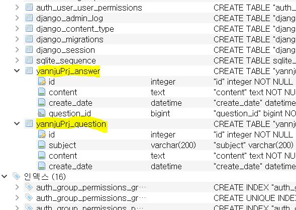

### 💫Django_DB💫
   - `SQLite` 를 이용하여 연동
     - python manage.py `migrate` 를 이용하여 migrate
     - python manage.py `createsuperuser` 를 이용하여 superuser 생성
   - admin 로그인 및 접속 가능
   - **ORM** : Object Relationship Mapping
     - 클래스로서 정의
     - 클래스명을 Table 명으로 Mapping 가능
     - 데이터 조작 또한 메소드를 통해 이루어짐
     - *[models.py](./yannjuPrj/models.py)* : DB 질문모델 작성 (즉, 클래스정의)
   - `Migration` → 클래스로 정의한 모델을 DB로 반영시킴
     - python manage.py `makemigrations` > *[0001_initial.py](./yannjuPrj/migrations/0001_initial.py)* 생성 : **아직 DB반영 안됨**
       - *[models.py](./yannjuPrj/models.py)* 에 테이블 작성
       - *[0001_initial.py](./yannjuPrj/migrations/0001_initial.py)* 을 토대로 DB에 반영(**migrate** 명령어 사용)
       - 
       - django_migrations 를 통해 history를 확인
     - 인스턴스 획득 후 속성값을 수정(**UPDATE**) → 이후 `save()` 사용
     - `delete()`를 이용한 데이터 삭제
     - 
   - **shell**을 이용하여 데이터 관리
     - Question 객체를 생성한 후 `save()` : save() 가 INSERT의 역할을 하여 DB에 데이터 추가, 그 전 까지는 ID를 확인할 수 없음
     - .JPG)
     - DB에 제대로 올라가있음을 확인
     - .JPG)
   - **shell**  을 이용하여 데이터 조회
     - `Question.objects.all()` 를 이용하여 전체 조회 (단 **Collection 타입**으로 return)
       - objects : select문을 담당
     - `Question.objects.filter(~)` 를 이용하여 조건 주기
     - .JPG)
       - filter는 동등 연산만 가능
     - `Question.objects.filter_by(~)` 를 이용하여 범위 연산 등 가능
     - `Question.objects.get(~)` 를 이용하여 단일 값(**인스턴스 타입**) 조회
       - 존재하지 않는 값을 조회하면 **에러** 발생 (filter는 에러 발생하지 않음)
       - PK로 검색할 때 주로 사용(단일값 or 없는값 이므로)
     - `Question.objects.filter(속성명__[언더바 두번]연산자 = 값)` 로 제목의 일부를 조회
       - **LIKE** 와 같은 기능을 함
   - 연관된 데이터 ORM으로 편리하게 관리
     - *1:1, 1:N, N:M*,  . . 여러 관계 유형
     - **JOIN**  필요없이 ORM 이 자동으로 해줌
      .JPG)
     - `question = q1` 의 q1는 전체 데이터가 아닌 **q1.id**가 들어가게 된다.
      .JPG) 
 - **Admin 사이트**에서 데이터 관리
   - *[admin.py](./yannjuPrj/admin.py)* 내에 클래스(테이블)을 import 하여 불러오면 admin 사이트에서 데이터를 추가 가능
   - `admin.ModelAdmin`을 상속받아 `search_files` 변수를 통해 검색 기능을 추가 가능
     - list_display, ordering . . 등 여러 다른 변수로 커스텀 가능
   - .JPG)