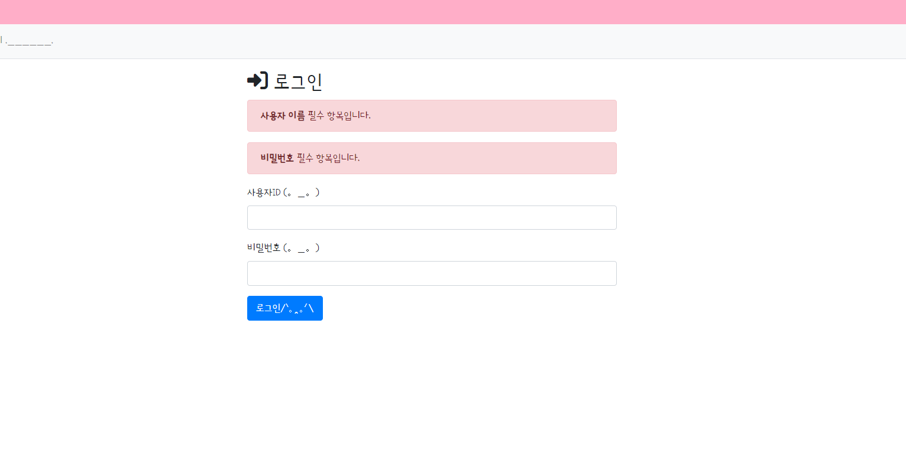
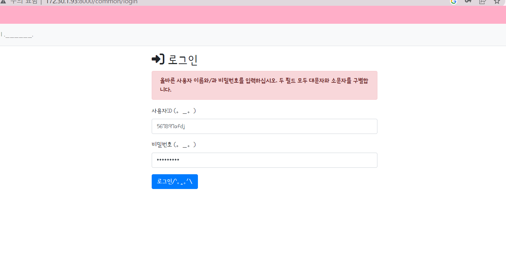
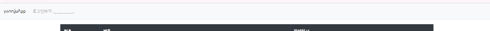
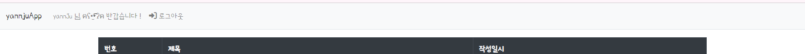
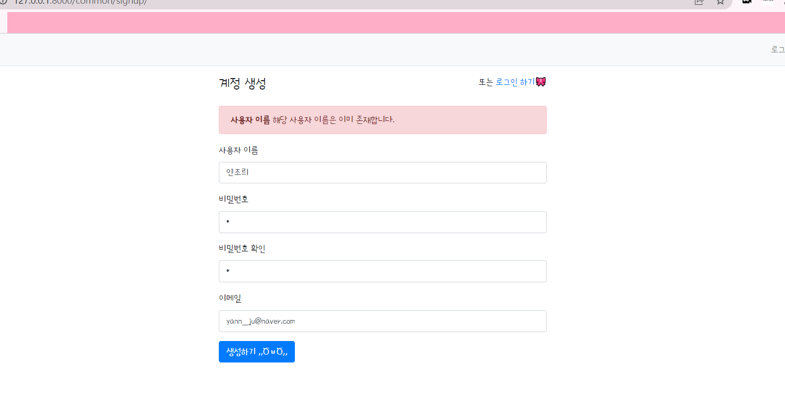

## 🎆Final Application🎆
### `yannJu`
---
- ### 회원관리 앱 추가
  - `django-admin startapp` 명령어를 이용하여 **common** 이라는 app을 추가
  - *[./config/settings.py > INSTALLED_APPS](./config/settings.py)* 에 `App` 접근을 위해 `common` 을 추가
  - `auth`를 이용하는데 주로 `CBV ` 즉 **클래스** 기준으로 관리
- ### 로그인 유저 동적으로 관리
  - **Login**
    - *[templates/navbar.html](templates/navbar.html)* 에 *로그인 주소*로 이동할 수 있도록 수정
    - *로그인주소* 는 위에서 새로 추가한 `common` 앱에서 관리
    - *[./common/urls.py](./common/urls.py)*  에서 `로그인 주소` URL을 추가
     
        ```python
        //./common/urls.py
        //<상위생략>
        path('login', auth_views.LoginView.as_view(template_name='common/login.html'), name='login'),
        //<하위생략>
        ```
    - `LoginView`를 이용하여 *Login 관리* 를 보다 편하게 이용할 수 있음
    - 로그인 URL로 이동하기 위해 `template_name`을 할당
    - 이후 **로그인 템플릿** 제작 (*[./templates/common/login.html](./templates/common/login.html)*) 및 에러처리
    - 에러처리는 `` 를 추가하여 *[./templates/form_errors.html](./templates/form_errors.html)* 에서 로그인 에러를 처리
     
    |
    --- | --- | 
  - **Logout**
    - *[templates/navbar.html](templates/navbar.html)* 에 로그인과 동일하게 추가
    - 단 **로그인 상태**를 확인해야함
     
        ```html
        <!--templates/navbar.html--d>
        
                <li class="nav-item ">
                    <a class="nav-link" href = '#'> {{user.username}} 님 ฅʕ•̫͡•ʔฅ 반갑습니다 !</a>                   
                </li>
                <li class="nav-item ">
                    <a  class="nav-link" href="">
                        <i class="fa-solid fa-right-to-bracket"></i>
                        로그아웃
                    </a>                   
                </li>
            
                <li class="nav-item ">
                    <a  class="nav-link" href="">로그인하기 .______.</a>                   
                </li>
            
        ``` 
        - `is_authenticated` 를 이용하여 `true`라면 로그인 상태이므로 **로그아웃 버튼**을 띄워준다.
        - `false` 인 경우 로그아웃 상태 이므로 **로그인 버튼** 을 띄워준다.
         
        
        
      - 로그아웃에 성공하게 되면 **초기화면으로** 돌아가도록 한다.
- ### 유저이미지 랜덤하게 제공 [(randomuser.me)](http://www.randomuser.me) 가능
- ### 회원가입 기능 추가
  - *유효성 검사* 및 Primary Key 를 체크 *(중복검사)* 해야함
  - `django.contrib.auth ` 에서 **회원관리** 기능을 제공
  - *[./templates/common/login.html](./templates/common/login.html)* 의 Login 헤더 옆에 `회원가입` 버튼을 생성 → **Grid** 를 부트스트랩을 이용하여 적용

    
  - *[./common/urls.py](./common/urls.py)*에 다음과 같이 `signup` URL을 *mapping*
   
    ```python
    //./common/urls.py
    //(... 생략 ...)
    from . import views
    //(... 생략 ...)
    urlpatterns = [
    //(... 생략 ...)
    path('signup/', views.signup, name='signup'),
        ]
    ```
  - **Form** 만들기
    - *[./common/forms.py](./common/forms.py)* 파일에 `UserForm`이라는 form을 생성
     
        ```python
        //./common/forms.py
        from django import forms
        from django.contrib.auth.forms import UserCreationForm
        from django.contrib.auth.models import User

        class UserForm(UserCreationForm):
            email = forms.EmailField(label='이메일')
            
            class Meta:
                model = User
                fields = ('username', 'email')
        ``` 
        - email과 같이 **재정의**할 수 있음
  - Signup **Template** 만들기
    - *[./templates/common/signup.html](./templates/common/signup.html)* 에 사용자이름, 비밀번호, 이메일 입력을 받을 수 있도록 *Template* 생성
    - `as_p`로 묶어 작성할 수 있지만, 보다 가시성을 높이기 위해 `field` 각각 작성

    
  - `AUTH_PASSWORD_VALIDATORS` 로 인해 보다 *복잡하게* Passwd를 관리할 수 있음
  - *[./common/views.py](./common/views.py)*
   
    ```python
    //./common/views.py
    //(생략..)
    if form.is_valid():
                form.save()
                username = form.cleaned_data.get('username')
                raw_password = form.cleaned_data.get('password1')
                user = authenticate(username=username, password=raw_password)
                login(request, user)
    //(생략..)
    ```
    - `authenticate` : user 이름을 체킹하고있다면 비밀번호 일치를 확인
      - user name : **O**, pwd : **O** → user객체 **생성**
      - user name : **X** 이거나 pwd : **X**  → **None** 을반환
    - `login` 을 거친 후 회원 *생성*
- ### 회원가입 에러 처리
  - **Login/Logout**  과 동일하게 *[form_errors.html](./templates/form_errors.html)* 을 연동시킴

     
- ### 회원가입 및 로그인 테스트
  - 회원가입 창에서 *정보* 입력   
   
     |
    ---|---|
  - 로그인 창에서 *로그인* 

    |
    ---|---|
- ### 로그인 버튼 위치 변경
  - 로그인 헤더와 같은 라인에 있던 위치를  변경
  - 로그인 **버튼** 아래에 회원가입 버튼 *추가*

   
- ### 게시글 각각에 허용 범위 설정
  - 게시글 *작성자* 추가하기
    - `Question` 객체에 `User`객체를 **Join**
      - *[./yannjuApp/models.py > Question](./yannjuApp/models.py)* 에 *auth* 추가
       
        ```python
        // ./yannjuApp/models.py
        from django.contrib.auth.models import User
        //(생략 . .)
        auth = models.ForeignKey(User, on_delete=models.CASCADE)
        //(생략 . .)
        ``` 
    - 객체에 *필드*를 추가 한 후 `migration`을 해 주어야함
    - 이때 *필드*가 추가되면서 **테이블 구조**가 바뀐 상태임에도 기존 데이터에도 *적용*을 시켜주어야함
    - 하지만 `author`는 **Not Null** 이므로 default 값이 지정 되어야함
      - `python manage.py makemigrations`를 하게 되면 해당 부분에 대한 **경고** 발생
      - default 값을 정해주고 `python manage.py migrate`를 실행시켜 DB에 적용
      - 다음과 같이 *[./yannjuApp/migrations/0002_question_auth.py](./yannjuApp/migrations/0002_question_auth.py)* 파일이 생성되며 작성됨

        ```python
        //./yannjuApp/migrations/0002_question_auth.py
        //(생략. .)
        operations = [
            migrations.AddField(
                model_name='question',
                name='auth',
                field=models.ForeignKey(default=1, on_delete=django.db.models.deletion.CASCADE, to='auth.user'),
                preserve_default=False,
            ),
        //(생략. .)
        ]
        ```
    - `Answer` 객체에도 동일하게 적용
    - 
  - **로그인 계정**만 게시글을 *작성*
- ### 수정 처리
  - 게시글 **작성자** 만 게시글을 수정
  - 오류처리 -> 범용처리
- ### 삭제 처리 `(V0.0.2-)`
  - 바로 **삭제** 되는 것을 방지 하기 위해 한번 더 묻는 창을 띄움
  - *[./templates/yannjuApp/question_detail.html](./templates/yannjuApp/question_detail.html)* 에 `삭제` 버튼 추가
    - 이 때 `bt4` 의 버튼 클래스가 아닌 **script** 사용 으로 *동적 처리* 진행
  - `data-uri`: 브라우저는 속성을 모름, 개발자만 알고 정보를 담기만 함 **'data-'** 로 시작하면 사용자 정의 속성 : script 처리를 해야함
  - *[base.html](./templates/base.html)* 에 script block 추가
   
   ```html
  <!--./templates/base.html-->
  <!--생략 . .25-26번줄-->
  <!-- Delete -->
  
  <!--생략 . .-->
   ```
  - *[./templates/yannjuApp/question_detail.html](./templates/yannjuApp/question_detail.html)* 에 `<script>` 블록을 만들고 동적처리를 진행

  ```html
  <!--./templates/yannjuApp/question_detail.html-->
  <!--생략..-->
  
  <script>
      $(document).ready(function(){
          $(".delete").on("click", function() {
              if (confirm("정말로 삭제 하시겠습니까?")) {
                  location.href = $(this).data('uri');
              }
          });
      });
  </script>
  
  ``` 
  - `script function`을 이용하여 해당 페이지가 준비되고, **delete** 클래스가 **click** 된 경우 `if`문 실행
  - *[./yannjuApp/urls.py](./yannjuApp/urls.py)*에 **delete** 주소를 mapping
  - *[./yannjuApp/views.py](./yannjuApp/views.py)* 에 기능을 작성

    .PNG)
    .PNG)
    .PNG)

- ### 답변 수정 및 삭제하기 `(V0.0.2-)`
  - *질문 수정 및 삭제* 와 **유사하게** 진행
  - *[./templates/yannjuApp/question_detail.html](./templates/yannjuApp/question_detail.html)* 의 답변 부분에 `수정`, `삭제` 버튼 생성
   
    .PNG)
  - 각 버튼 당 `url`을 설정하여 mapping
  - *[./yannjuApp/views.py](./yannjuApp/views.py)* 에 기능을 처리하는 함수를 구현
    - 수정 : *[./templates/yannjuApp/answer_form.html](./templates/yannjuApp/answer_form.html)* 을 이용하여 재작성 후 `save`
    - 삭제 : 질문 삭제와 유사하게 `script`를 통해 삭제여부 다시 묻기
- ### Bootstrap Form 이용하기
  - 기존의 `로그인` form 이 아닌 **Bootstrap** 에서 제공하는 Form 을 통해 템플릿 구성
  - *[./config/settings.py](./config/settings.py)* 의 `INSTALLED_APPS` 에 **'bootstrap4'** 을 추가
  - 이후 `bootstrap` form을 사용할 경우 `load` 및 불러오기
   
    ```html
    <!--./templates/yannjuApp/answer_form.html-->
    
    

    
    <form method="POST" class='post-form'>
        
        

        <button type='submit' class="btn btn-primary"> 저장하기 </button>
    </form>
    
    ```
    - 상단에 `load`를 통해 **bootstrap** 을 불러온 후 중간에 `` form 사용
    - *[./templates/common/signup.html](./templates/common/signup.html)* 에 기존 작성했던 속성들을 지우고 위처럼 `` form 작성

    .PNG)
  - `로그인, 답변수정` 등에도 동일하게 *적용*
- ### 댓글기능 추가`(V0.0.2-)`
  - 
---
## 🧨미해결
→ (0223) `NavBar`가 자동으로 닫힘 

~ → (0224) 로그인 창에서 `로그인` 버튼이 기능을 안함 ~ **[해결]**